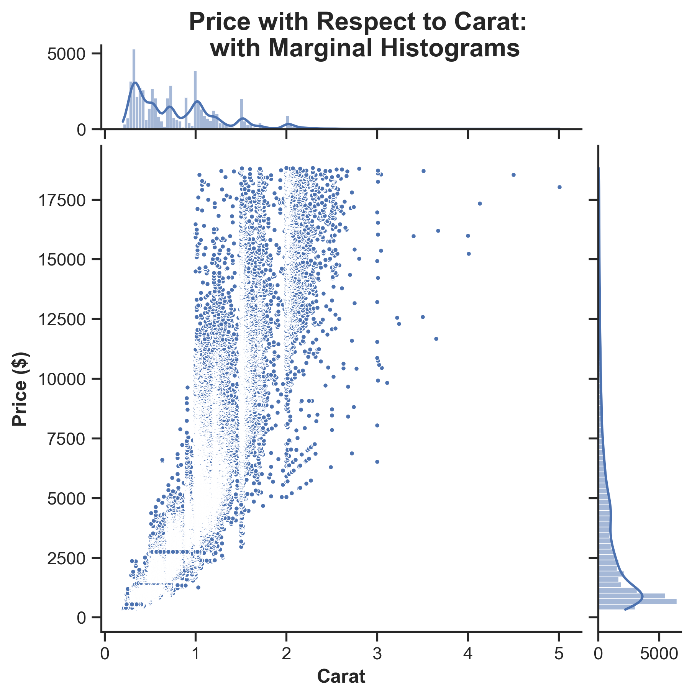
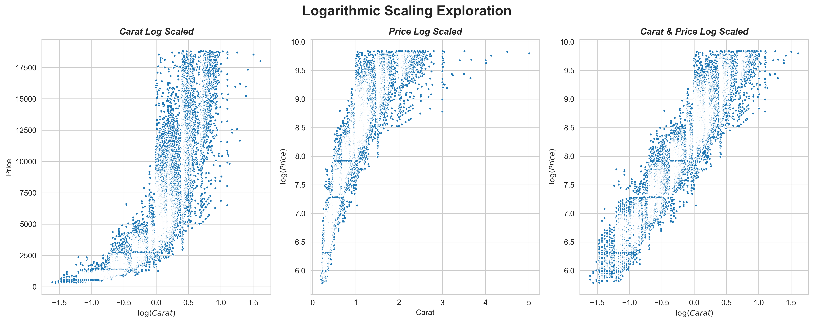
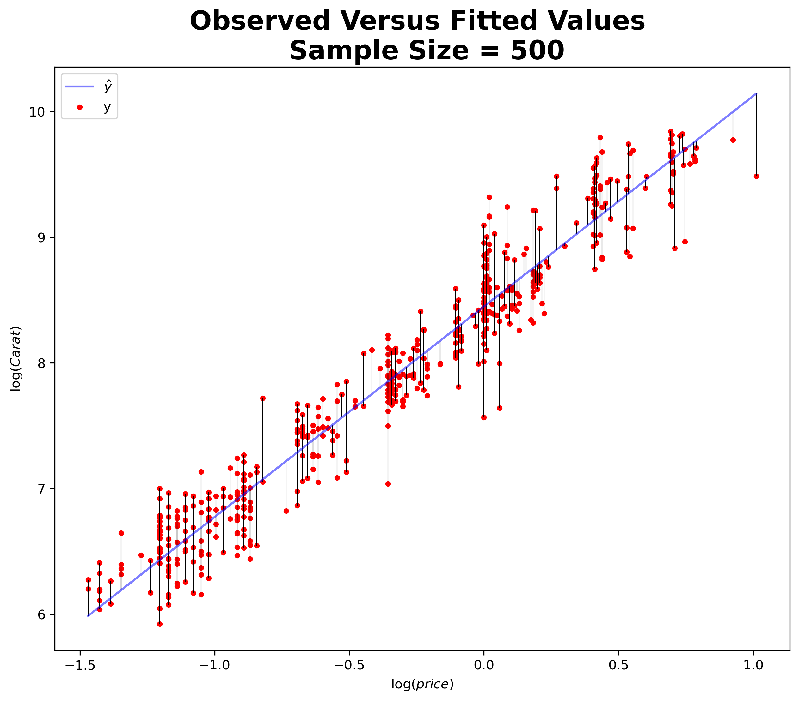
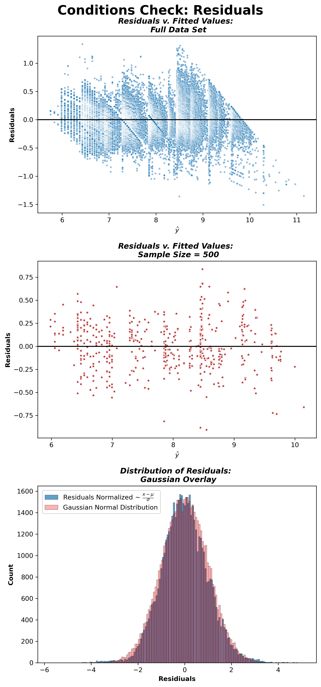
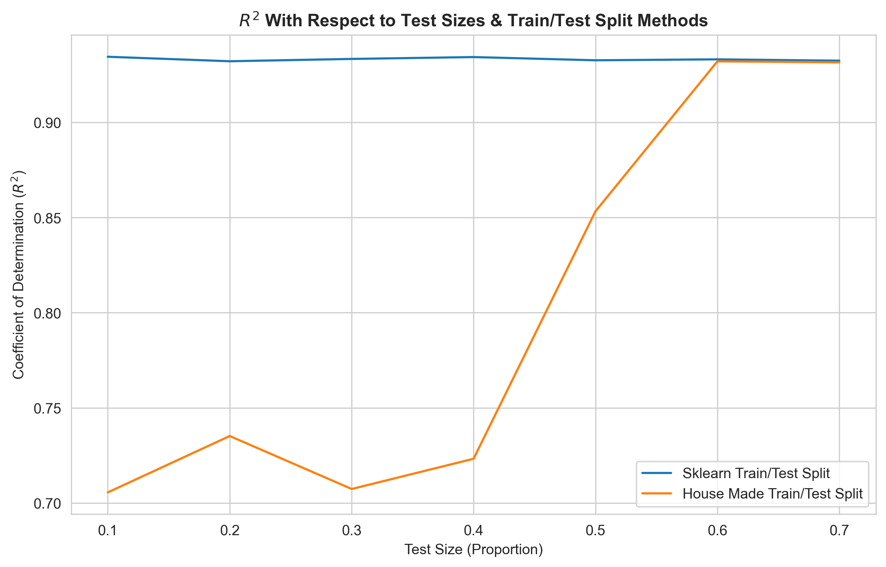
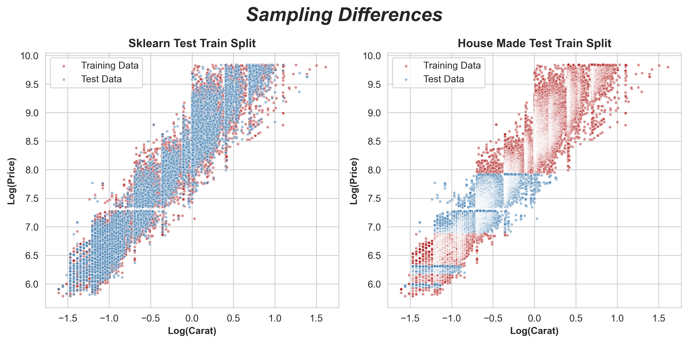
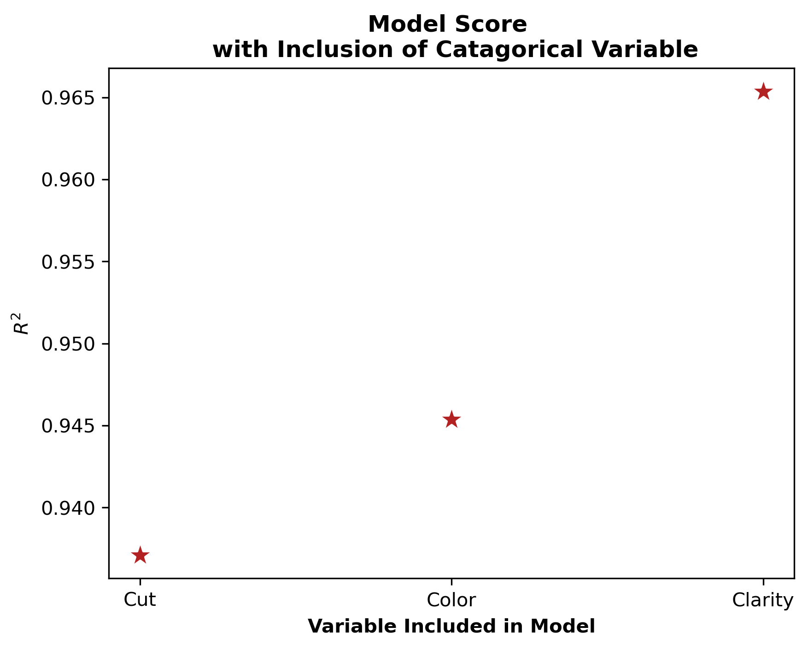
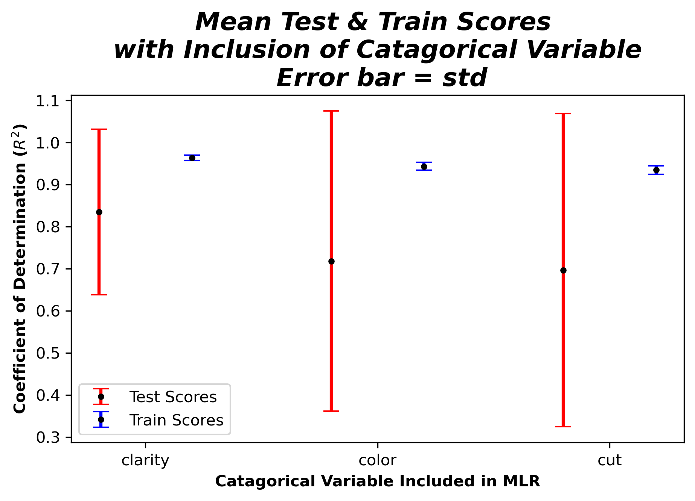
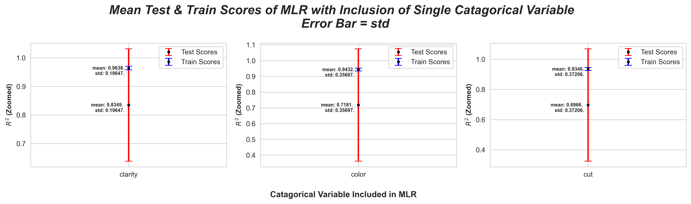
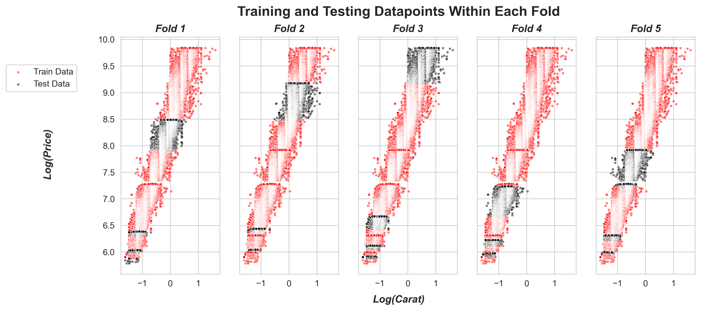

# hw-diamonds

## Assignment

Use the [diamonds dataset](https://ggplot2.tidyverse.org/reference/diamonds.html) to answer the questions below.
You can get the data directly from the "data-raw" directory in the [ggplot2 github repo](https://github.com/tidyverse/ggplot2/).

## Step 1: Check ```requirements.yml```
If you have all the required packages proceed to step 2, otherwise create a virtual environment with one of the the following commands.

This command will create a conda generated virtual environment
```
make init
```
This command will create a manually generated virtual environment
```
make man_gen_env
```
## Step 2: Create ```figs``` directory
This command will create a ```figs``` folder if it does not already exist.
```
make create_directory
```

## Step 3: Question 1

Visualize the relationship between "price" and "carat" and comment on the type of model that 
might be appropriate for modeling their relationship.

This command will reproduce the following figure
```
make q1
```


This figure appears to indicate that there is a positive linear relationship between ```carat``` and ```price```. As ```carat``` increases, ```price``` icnreases. A linear model is likely appropriate for modeling this relationship.

## Step 4: Question 2

Investigate logarithmic transformations to see if you can find a more appropriate relationship
between ```price``` and ```carat``` for univariate linear regression.
Use data visualization to help justify your choice of model.
Use explained variance score as a metric for model performance, and report training scores based on the entire dataset.

This command will reproduce the following figure.
```
make q2_a
```


This figure indicates that log scaling both variables is the most appropriate if fitting a simple linear model. If scaling neither variable, or one or the other, the linear model will not capture the complexity of the data, i.e, the linear model will be too biased.

This command will execute an SLR using ```sklean``` with ```carat``` and ```price``` both log scaled.
```
make q2_b
```
These are the results:
```
The coefficient of determination for the sklearn linear model is 0.9330.
```
This command will execute an SLR using ```statsmodels``` with ```carat``` and ```price``` both log scaled. It will also generate two figures with the results; one displaying the observed versus the fitted values, and the other displaying the behavior of the residuals.
```
make q2_c
```
These results from ```statsmodels``` SLR.
```
                            OLS Regression Results                            
==============================================================================
Dep. Variable:                  price   R-squared:                       0.933
Model:                            OLS   Adj. R-squared:                  0.933
Method:                 Least Squares   F-statistic:                 7.510e+05
Date:                Sat, 04 Nov 2023   Prob (F-statistic):               0.00
Time:                        14:35:17   Log-Likelihood:                -4424.2
No. Observations:               53940   AIC:                             8852.
Df Residuals:                   53938   BIC:                             8870.
Df Model:                           1                                         
Covariance Type:            nonrobust                                         
==============================================================================
                 coef    std err          t      P>|t|      [0.025      0.975]
------------------------------------------------------------------------------
carat          1.6758      0.002    866.590      0.000       1.672       1.680
constant       8.4487      0.001   6190.896      0.000       8.446       8.451
==============================================================================
Omnibus:                      877.676   Durbin-Watson:                   1.227
Prob(Omnibus):                  0.000   Jarque-Bera (JB):             1679.882
Skew:                           0.072   Prob(JB):                         0.00
Kurtosis:                       3.853   Cond. No.                         2.08
==============================================================================

Notes:
[1] Standard Errors assume that the covariance matrix of the errors is correctly specified.
The coefficient of determination for the stats models linear model is 0.9330.
```
These figures are generated using the results from ```statsmodels``` SLR





## Step 5: Question 3

Use the `simple_train_test_split` function below and `sklearn.model_selection.train_test_split` 
to evaluate the explained variance of the univariate model using the testing dataset.
Use explained variance as a metric for model performance.
Describe the results and create a visualization that helps explain the differences between the two approaches.
```
def simple_train_test_split(X, y, test_size=.3):
    n_training_samples = int((1.0 - test_size) * X.shape[0])

    X_train = X[:n_training_samples,:]
    y_train = y[:n_training_samples]

    X_test = X[n_training_samples:,:]
    y_test = y[n_training_samples:]

    return X_train, X_test, y_train, y_test
```
This command will reproduce the following two figures
```
make q3
```


The figure displays the coeffecient of determination of SLRs executed with various test sizes using the two different train/test split functions. This figure demonstrates that there is considerable differences in $R^2$ for the models until the testing proportion reaches $0.60$. The next figure will help elucidate the cause.



This figure displays the specific data points that are selected for testing and trainig by the two different test/train split functions (both test proportions in this case are $0.30$). It shows that ```simple_train_test_split``` is not randomly selecting elements from the data. Compounding the impact of this selection strategy is the dataset is sorted is descending order by ```price```. This means that ```simple_train_test_split``` is not selecting a training set that is representative of the data, and specifically, not representative of test data.

## Step 6: Question 4

Use one-hot encoding to find the best 2-input model by adding either "cut", "color" or "clarity" as a second predictor along with "log(carat)" to model "log(price)". Which 2-input model has the best performance? Report the training score
with explained variance metric, using the entire dataset for both training and evaluation. Compare to the corresponding univariate model in question 2. What's the ".shape" of the feature matrix for the "best" model?

This command execute the models and reproduce the following results.
```
make q4
```


This figure displays the coefficient of determination ($R^2$) of MLRs using ```log(carat)``` and one catagorical variable (```cut```, ```clarity```, or ```color```) to predict ```log(price)```. The figure shows that using ```log(carat)``` and ```clarity``` performed the best, with an $R^2 \approx 0.965$.

These are the outputs from the python script.
```
The additional variable that performed the best is: Clarity.
Using Clarity in the model, the coefficient of determination is: 0.9654.
The shape of the feature matrix for this model is: (53940, 8).
```

Compared to the univariate model in question 2, this MLR is able to explain a greater proportion of variability of the reponse variable, ```log(price)```.

Recall the results of the two models:

SLR from question 2:
```
The coefficient of determination for the sklearn linear model is 0.9330.
```
MLR from question 4:
```
Using Clarity in the model, the coefficient of determination is: 0.9654.
```
## Step 7: Question 5

Repeat the analysis of Question 4, this time using 5-fold cross validation.
Report both train and test scores (average +/- standard deviation).
Compare results here with those of Question 4.
Discuss results and explain any significant differences with Question 4.

This command will reproduce the following figures.
```
make q5
```


This figure displays the mean train scores and mean test scores of the 5 MLRs performed using 5-fold cross validation with a test size of $0.30$. The error bars in the figure are the standard deviation. This figure demonstrates that while mean train $R^2$ for 5-fold cross validation is close to the $R^2$ obtained from the using the entire dataset in question $4$, the test $R^2$ is considerably lower, with a high degree of variability. This next figure with give a closer look.



This figure provides a closer look at the mean test and mean train scores.

Why would this be? 



This figure explains the descrepancy. It shows the specific data points used in each of the folds. As was the case in quesion 3, the spliting procdure used by ```cross_validate``` is not, by default, shuffling the data. As previously discussed, this dataset is sorted in descending order by ```price```. This means that the model is not being trained on set of datapoints that is representative of the entire dataset. Using ```shuffle_split``` would improve these results. It is my hypothesis that K-fold, in this instance, is providing a pessimistic score.